# :toolbox: Utilizando esse Produto

## Especificações da Estrutura do Projeto

- Java - Nesta ocasião estamos utilizando o Java `17`;
- SDK - `21`;
- Módules - SDK `21`;
- Language Level - Java `21`;
- Spring Boot `3`.

> Para verificar no Itellij và a: File -> Project Structure -> Project

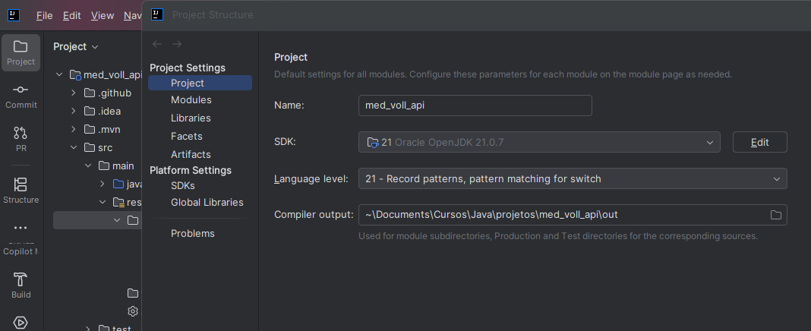
<br>
<br>

## Criando um Novo Projeto:

Para criar um novo projeto acesse o site: [Spring Initializr](https://start.spring.io/).
Neste projeto iremos utilizar:

- Projetc : Maven;
- Language : Java;
- Spring Boot : `3.5.7` (Neste caso estamos utilizando esta versão);
- Java : `17`;
- Package - `jar`.

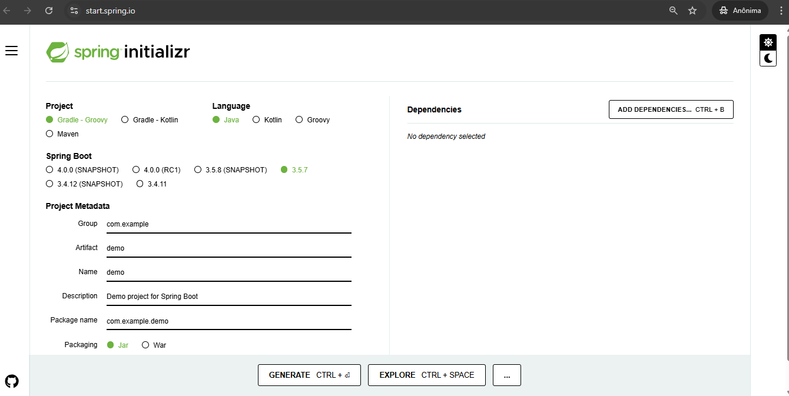
<br>
<br>

## Criando meu Repo no Github:

- RepoName: [med_voll_api](https://github.com/analaurafra/med_voll_api)
- Workflow: [co-cd - YML](https://github.com/analaurafra/med_voll_api/blob/main/.github/workflows/ci-cd.yml)

**Nota**: Neste caso realizei a configuração de um arquivo yml para acompanhar na esteira a evolução do projeto.
Inicialmente as sessões de testes unitários foram comentadas.
Foi incluindo esse tipo de arquivo para abranger as rotinas de CI e CI.

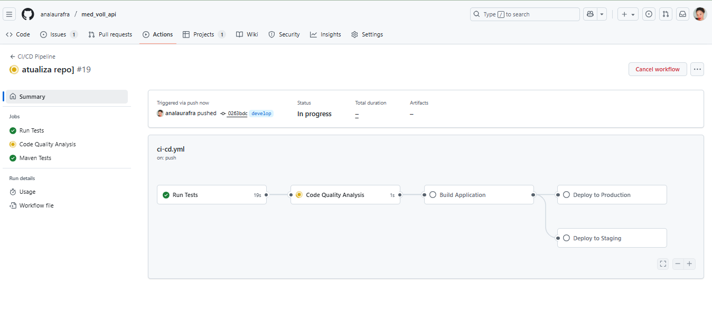
<br>
<br>

## Scrum:

Foi criado um projeto através das ferramentas de Github Projetos em formato de [Kanban Board](https://github.com/users/analaurafra/projects/1/views/1), onde as **Issues** são evoluídas, conforme evolução
do projeto.

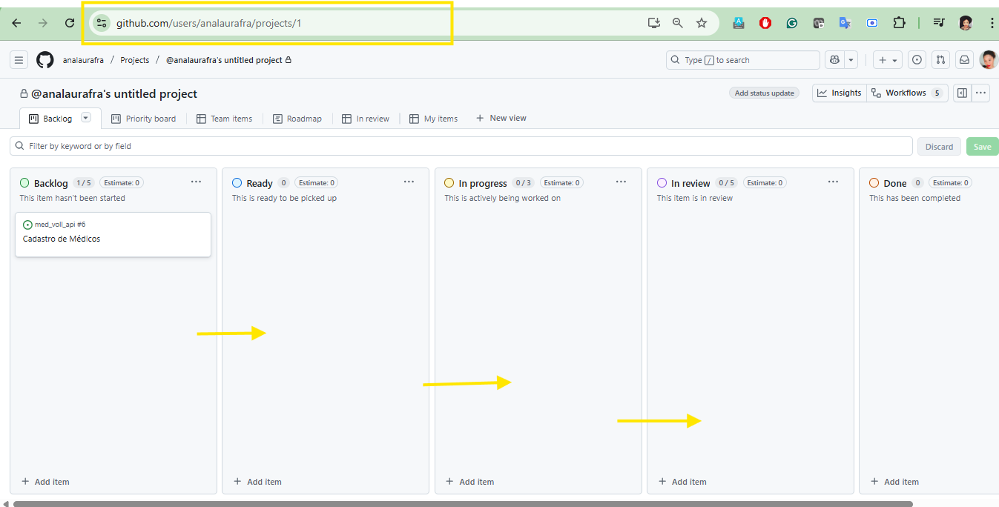
<br>
<br>

## Configurações de Build - Maven

Após incluir um projeto novo ou obtê-lo através de um projeto já existente, é necessário atualizar as dependências do Maven

> Acesse ao Maven e realizei o **clean** e o **install** para baixar todas as dependências necessárias. Verifique as configurações em sua IDE acessando:`View -> Tool Windows -> Maven`

> O Maven também poderá ser instalado via Plugin em sua IDE, acesse as configurações de sua IDE e busque por: `Plugins -> Marketplace -> Maven`

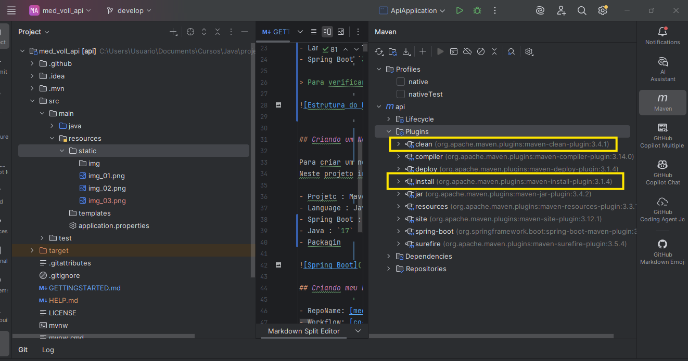
<br>
<br>

## Testando a API:

Neste caso utilizaremos o **Insomnia**, mas temos como opção o **Postman**.

Para realizar essa configuração siga o passo a passo:

### Passo 01
Para iniciarmos a utilização do Insomnia, baixe o software através do site: [Insomnia](https://insomnia.rest/download)

Após a instalação, abra o software e crie um novo projeto, clicando em "Create" e selecionando "New Request".

<br>
<br>

### Passo 02
No menu lateral esquerdo identifique a opção `Colletions`, criei um nome para sua colletion, neste caso nomearemos como **Requisições**, pois será neste collection que testaremos o **CRUD** do nosso sistema.

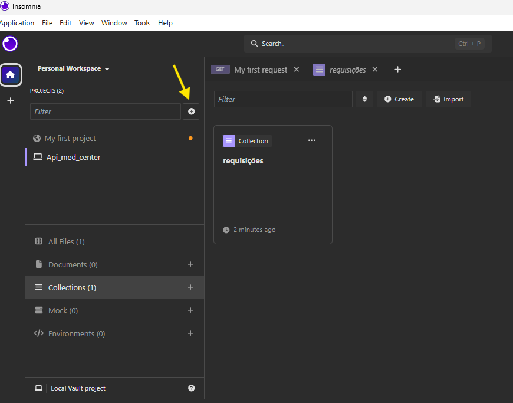
<br>

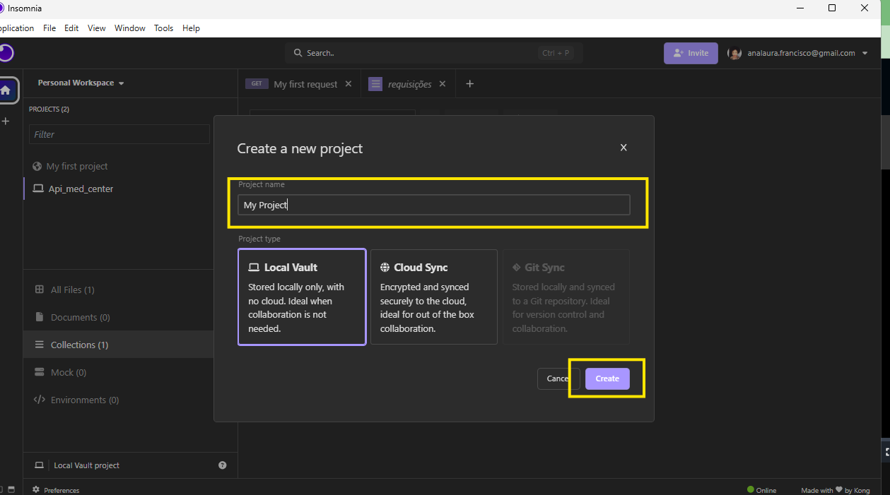
<br>

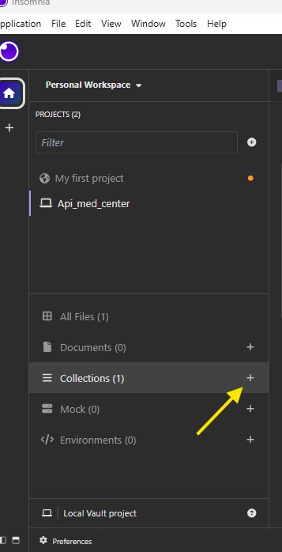
<br>

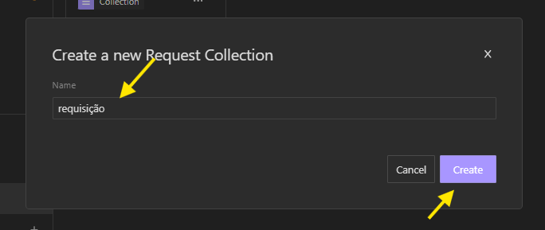
<br>
<br>
Após nomear a Collection Requisição, selecione o método HTTP desejado **(GET, POST, PUT, DELETE, etc.)** e insira a URL da API que você deseja testar.


<br>

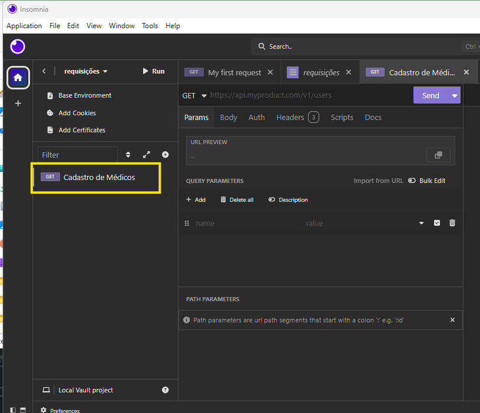
<br>
<br>

Iniciaremos com o **Método POST**, o qual irá **enviar** os dados para a API.

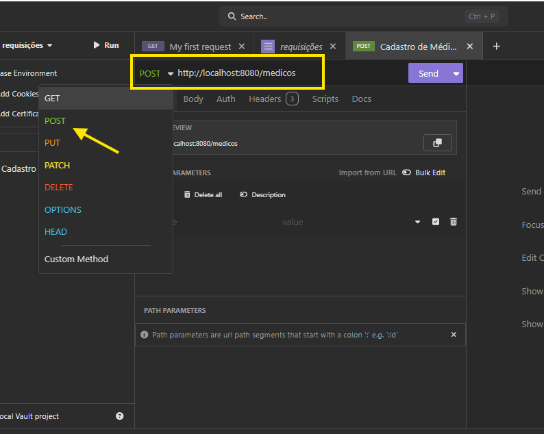
<br>
<br>

Antes de enviar a requisição é necessário informar o corpo da requisição. Quais dados serão enviados para a API.
Neste caso utilizaremos o formato **JSON**. 

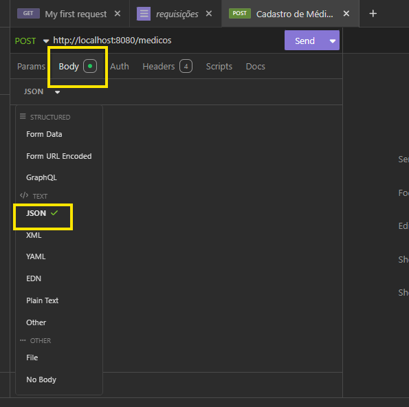
<br>
<br>

Utilize o exemplo abaixo no prompt de corpo da requisição:

```
{
"nome": "Ana Laura Martins",
"email": "analaura_fra@vmed.center.com",
"crm": "123456",
"especialidade": "ortopedia",
"endereco": {
    "logradouro": "rua 1",
    "bairro": "bairro",
    "cep": "12345678",
    "cidade": "Brasilia",
    "uf": "DF",
    "numero": "1",
    "complemento": "complemento"
    }
}

```

Na imagem abaixo temos o exemplo do corpo da requisição preenchida e enviada, porém temos como resultado um erro, já previsível, pois estamos realizando uma requisição para o endereço
[http://localhost:8080/medicos](http://localhost:8080/medicos), porém ainda não foi criado nenhum `controller` na nossa aplicação, que atenda a essa requisição.


<br>
<br>
